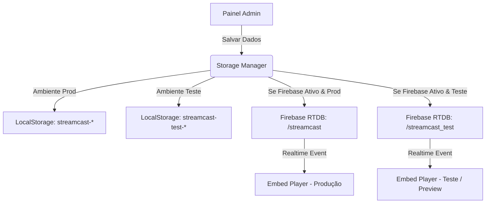

# 📚 Documentação Geral das Funcionalidades do Sistema StreamCast

> **Versão:** 1.0.0 (Com Suporte a Ambiente de Testes & Preview Interativo)  
> **Data:** Agosto / 2026  
> **Tecnologias:** React 18, TypeScript, Vite, TailwindCSS, Firebase Realtime Database, IndexedDB, HLS.js, TMDB API.

---

## 📌 1. Visão Geral do Sistema

O **StreamCast** é uma plataforma profissional de gerenciamento e reprodução de mídias de vídeo com suporte a sincronização cross-origin em tempo real. O sistema permite criar playlists, configurar horários de exibição (agendamento), realizar pesquisas em bases de dados como o TMDB, fazer upload de vídeos pesados via IndexedDB e incorporar o player em sites externos usando `iframe` (Embed).

---

## 🧪 2. Arquitetura de Ambientes (Produção vs Teste)

Para evitar que testes de playlist ou configurações alterem o ambiente real de produção, o StreamCast conta com um **Sistema de Ambientes Isolados**:

| Recurso | 🟢 Ambiente de Produção | 🧪 Ambiente de Teste (Staging) |
| :--- | :--- | :--- |
| **Rota Firebase Database** | `/streamcast` | `/streamcast_test` |
| **Chaves no LocalStorage** | `streamcast-config`, `streamcast-playlist`, etc. | `streamcast-test-config`, `streamcast-test-playlist`, etc. |
| **Parâmetro de URL** | `?env=prod` (ou padrão) | `?env=test` |
| **Identificador Visual** | Badge Verde "🟢 Produção" | Banner Superior Alerta Amarelo "🧪 AMBIENTE DE TESTE ATIVO" |
| **Uso Recomendado** | Exibição real aos clientes/usuários finais | Autonomia total para adicionar, remover e testar mídias |

### 💡 Autonomia no Modo de Teste
- No **Painel Admin**, o usuário pode alternar entre **Produção** e **Teste** com um clique no topo.
- Na aba **🧪 Testar Embed Vivo** dentro do próprio Painel Admin, é possível testar o player incorporado em tempo real em molduras de **Desktop**, **Tablet** e **Mobile** sem precisar sair do sistema ou abrir abas externas.

---

## 🎬 3. Mapeamento de Módulos e Funções

### 🖥️ 3.1 Player Principal (`VideoPlayer.tsx`)
- **Múltiplos Provedores de Vídeo**:
  - **HLS (.m3u8)**: suporte a streams de transmissão ao vivo e VOD com qualidade adaptativa automatizada via HLS.js.
  - **Direto (MP4 / WebM)**: reprodução direta de arquivos de vídeo via HTML5 Video element.
  - **EmbedMaster / VidSrc**: integração para carregamento de Filmes e Séries via TMDB ID ou IMDb ID.
  - **YouTube API**: reprodução de mídias do YouTube com tratamento de bloqueio por timeout e fallback.
- **Renderizador Customizado de Legendas**:
  - Busca automática via proxy VTT/SRT.
  - Tratamento e sanitização de caracteres corrompidos em português (ex: acentuação e cedilha).
- **Controles de HUD**:
  - Botão de comutação de servidor (SVR).
  - Controle de volume, mutar/desmutar, progresso e tela cheia (Fullscreen).

---

### ⚙️ 3.2 Painel Administrativo (`AdminPanel.tsx`)

O Painel Admin é organizado em 7 abas principais:

1. **🌐 Internet**:
   - Busca em plataformas externas (YouTube, Vimeo, Dailymotion, Archive.org).
   - Adição direta por URL.

2. **🔍 Buscar (Integração TMDB)**:
   - Pesquisa de mídias (Filmes e Séries) na API do The Movie Database (TMDB) com filtros em Português e Inglês.
   - Preenchimento automático de capa (poster), IDs externos (IMDb), sinopse e tags de gênero.

3. **📤 Upload (Mídias Locais)**:
   - Suporte a upload de arquivos locais de vídeo.
   - Armazenamento binário no **IndexedDB** do navegador para contornar os limites do `localStorage` e permitir mídias de grande porte sem queda de desempenho.

4. **📋 Playlist**:
   - Listagem completa das mídias cadastradas.
   - Reordenação de exibição.
   - Gerenciador de **Tags de Gênero** para categorização.
   - Exclusão e limpeza de mídias.

5. **🕒 Agenda (Schedule)**:
   - Criação de regras de agendamento por dias da semana e horários (início e término).
   - O player alterna automaticamente para a mídia agendada assim que o horário atinge a regra ativa.

6. **⚙️ Configurações**:
   - Alternância de comportamento: Reprodução Automática (Autoplay), Muted padrão, Loop da playlist e Ativação de Agendamentos.
   - Seleção do provedor primário (`vidsrc`, `youtube`, `direct`).
   - Configuração de idioma de legendas e chave de API pessoal do TMDB.

7. **🧪 Testar Embed Vivo (Preview Interativo)**:
   - Moldura de teste em tempo real onde o usuário vê exatamente o comportamento do Embed.
   - Seleção de viewport (Desktop: 100%, Tablet: 768px, Mobile: 380px).
   - Gerador de código Embed configurável para Produção (`?env=prod`) ou Teste (`?env=test`).

---

### 📺 3.3 Embed Player (`embedPlayer.tsx`)
- **Player Minimalista**:
  - Projetado para ser carregado dentro de `<iframe>` em qualquer site externo.
- **Sincronização em Tempo Real**:
  - Escuta ativa das alterações no Firebase Realtime Database na rota correspondente (`/streamcast` ou `/streamcast_test`).
  - Atualização síncrona instantânea quando o administrador salva alterações no painel.
- **Auto-Avanço Inteligente (Autonext)**:
  - Ao término de um filme ou episódio, o player calcula o próximo item na playlist ou consulta a API do TMDB para determinar o próximo episódio da temporada.
- **Gerenciador de Memória Preventivo (Auto-Cleanup)**:
  - Limpeza automática de caches de sessão a cada 10 minutos para evitar estouro de RAM em dispositivos embarcados ou Smart TVs.

---

## 🔄 4. Camadas de Dados e Sincronização

---

## 🛠️ 5. Guia Rápido de Testes

1. Para testar o sistema em modo de teste isolado:
   - Acesse `http://localhost:3000/?env=test`
   - Abra o **Painel Admin** (ícone engrenagem no canto superior direito).
   - Certifique-se de que o botão no topo indica `🧪 Teste`.
   - Faça edições na playlist (adicione ou remova vídeos).
   - Vá para a aba **🧪 Testar Embed Vivo** e veja o player sincronizando em tempo real sem afetar a versão principal de produção!
